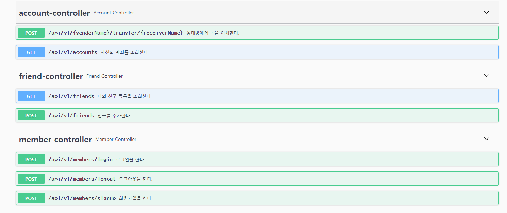

# banking-server

Member Entity를 참조하는 Friend Entity를 만들어 member는 본인, friend는 상대방으로 구현.

Restful API 사용

하나의 계좌에 동시에 돈이 입금되는 상황이 발생하는 경우는 @Transactional과 mysql의 MVCC 기능으로 인해 발생하지 않을 걸로 판단

최대한 클린 아키텍처를 지향하고 객체지향을 준수하려고 노력했다.
비즈니스 로직에서는 읽기 쉬운 코드를 유지하려고 애썼다.

Numble Bank가 대용량 트래픽에도 끄떡없이 설계하려면 우선적으로 MSA 방식으로 구성하는게 좋을 것 같고
Spring WebFlux와 같은 비동기 처리 방식을 도입하는 것도 나쁘지 않아 보인다. 
DB의 과부하로 인한 트래픽 문제가 생긴다면 시계열 DB를 생각해볼 수도 있을 것 같다.

테스트 코드를 많이 작성해보지 않아서 어떤 부분까지를 단위로 볼 것이고 어떤 것을 통합할 지 고민했다.
특히 로그인 기능은 각 클래스 단위로 테스트하는 것이 무의미하다 판단하여 @SpringBootTest를 통해 테스트를 했다.

문서에 대한 자동화로 Swagger 사용
